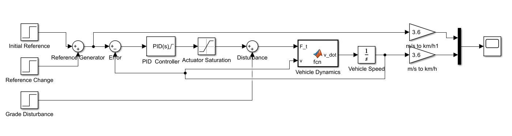
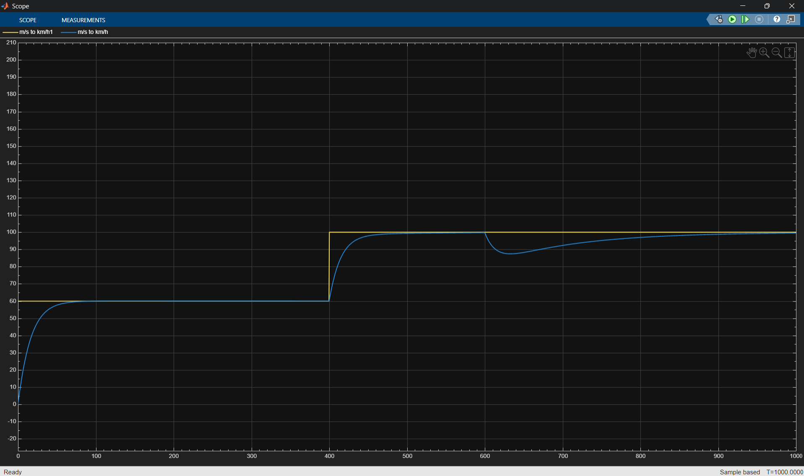

# Vehicle Cruise Control using PID Controller

## Overview

This project presents the modeling and control of a vehicle longitudinal dynamics system using MATLAB and Simulink.

The main objective is to design a cruise control system that regulates the vehicle speed to a desired reference speed of **100 km/h** while maintaining stable tracking and rejecting external disturbances.

The project includes open-loop vehicle dynamics, PI control analysis in MATLAB, and a final PID-based cruise control implementation in Simulink.

## Project Structure

```text
Vehicle-Cruise-Control-PID/
│
├── MATLAB/
│   ├── parameters.m
│   ├── vehicle_model.m
│   └── cruise_control_pid.m
│
├── Simulink/
│   └── cruise_control.slx
│
├── Results/
│   ├── simulink_final_model.png
│   ├── open_loop_response.png
│   └── final_pid_response.png
│
└── README.md
```

## Vehicle Model

The longitudinal vehicle dynamics are modeled using the following forces:

* Traction force
* Aerodynamic drag
* Rolling resistance

The vehicle parameters used in the simulation are:

| Parameter                      | Value | Unit  |
| ------------------------------ | ----: | ----- |
| Vehicle mass                   |  1500 | kg    |
| Drag coefficient               |  0.30 | -     |
| Frontal area                   |   2.2 | m²    |
| Rolling resistance coefficient |  0.01 | -     |
| Wheel radius                   |  0.30 | m     |
| Air density                    | 1.225 | kg/m³ |
| Gravitational acceleration     |  9.81 | m/s²  |

The aerodynamic drag force is modeled as:

$$
F_{drag} = \frac{1}{2}\rho C_d A v^2
$$

The rolling resistance is:

$$
F_{rolling} = C_{rr}mg
$$

The total resistance is therefore:

$$
F_{resistance}=F_{drag}+F_{rolling}
$$

## Control System

The project investigates feedback-based cruise control using proportional, integral, and derivative control actions.

The final Simulink implementation uses a PID controller with actuator saturation and anti-windup handling.

The selected controller gains are:

| Gain | Value |
| ---- | ----: |
| Kp   |    20 |
| Ki   |   0.5 |
| Kd   |     5 |

The reference vehicle speed is:

$$
v_{ref}=100\;km/h
$$

The controller aims to minimize the tracking error:

$$
e(t)=v_{ref}(t)-v(t)
$$

## Simulink Model

The final cruise control system was implemented in Simulink.

The model contains the reference input, feedback control loop, PID controller, actuator limitation, vehicle dynamics, and disturbance input.



## Open-Loop Response

The open-loop vehicle response was evaluated before applying feedback control.


The open-loop response demonstrates the vehicle's natural longitudinal behavior under a fixed traction force and the effect of aerodynamic and rolling resistance.

## PID Response

The final closed-loop system tracks the desired vehicle speed and compensates for external disturbances.



The final response demonstrates:

* Reference speed tracking
* Stable convergence toward 100 km/h
* Disturbance rejection
* Recovery of the vehicle speed after the disturbance
* Reduced steady-state error

## Disturbance Rejection

An external disturbance is introduced during the simulation to evaluate the robustness of the cruise control system.

The controller temporarily responds to the resulting speed deviation and drives the vehicle speed back toward the reference value.

This demonstrates the ability of the closed-loop system to maintain the desired cruising speed despite changes in the vehicle's operating conditions.

## MATLAB Files

### `parameters.m`

Contains the main physical parameters of the vehicle and environment.

### `vehicle_model.m`

Implements a PI-based vehicle cruise control model and provides a MATLAB reference for the controlled vehicle response.

### `cruise_control_pid.m`

Provides a MATLAB-based PID cruise control simulation using the same vehicle parameters and controller gains.

## How to Run

### MATLAB

1. Open MATLAB.
2. Add the `MATLAB` folder to the MATLAB path.
3. Run `vehicle_model.m` for the PI response.
4. Run `cruise_control_pid.m` for the PID response.

### Simulink

1. Open the `Simulink` folder.
2. Open `cruise_control.slx`.
3. Run the simulation.
4. Open the Scope to observe the reference, vehicle speed, and disturbance signals.

## Tools

* MATLAB
* Simulink
* PID Control
* ODE45
* Vehicle Longitudinal Dynamics

## Project Goal

This project demonstrates the complete workflow of a basic automotive cruise control system:

**Vehicle Modeling → Open-Loop Analysis → Feedback Control → PID Tuning → Saturation & Anti-Windup → Disturbance Rejection → Performance Evaluation**